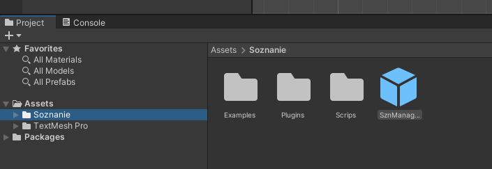
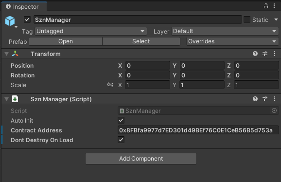
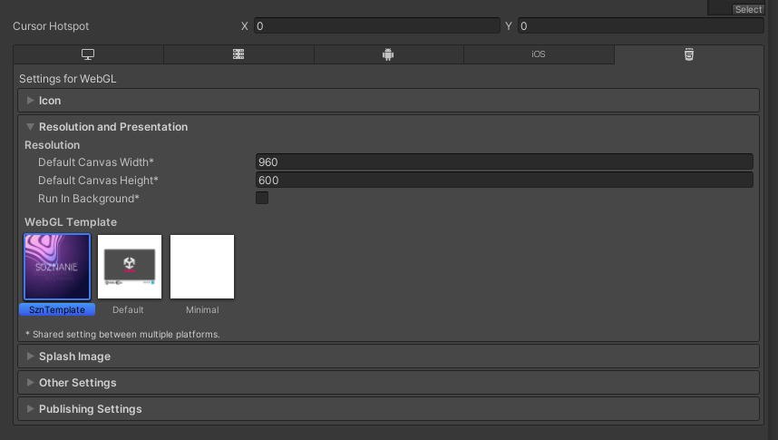

# szn-unity-asset
 Unity asset for Soznanie project

# 1. Installation
1. Загрузите [SoznanieAsset.unitypackage](SoznanieAsset.unitypackage) и ипортируйте его в юнити.
2. Из главной папки Soznanie возьмите префаб SznManager и поместите его на сцену в любое место.

   
3. Подготовьте SznManager под ваше приложение. В инспекторе свойств у объекта SznManager настройте следующие параметры:
   
   `Auto Init` `(по умолчанию true)` указывает на то, что объект SznManager будет иницилизирован автоматически.
   > Tip: Если вам необходимо провести инициализацию в определенном месте кода, то отключите этот параметр и используйте `SznManager.Init()` в скрипте.

   `Contract Address` адрес вашего игрового контракта на платформе Soznanie.

    `Don't Destroy On Load` `(по умолчанию false)` SznManager это Singleton. Включите этот параметр, если не используете собственный менеджер для синглтонов.

   
4. На сцене создайте `Canvas`, добавьте в него кнопку, дайте ей имя _ConnectToWallet_.
5. Создайте скрипт Demo.cs и добавьте в него следующий код:
   ```c#
    using System.Collections.Generic;
    using UnityEngine;

    using Soznanie;

    namespace Demo
    {
        public class Demo : MonoBehaviour
        {
            void Start()
            {
                SznManager.Initialized += OnAccountsChanged;
                SznManager.InitializationFailed += OnInitializationFailed;

                SznManager.AccountsChanged += OnAccountsChanged;
                SznManager.ChainChanged += OnChainChanged;
            }

            private void Connected()
            {
                // Show your game! Metamask is connected!
            }
            private void Disconnected()
            {
                // Ooops. Show disconnect message. There are not any accounts.
            }

            private void OnInitializationFailed()
            {
                Debug.LogError("Install Metamask wallet and reload this page.");
            }

            private void OnAccountsChanged(List<string> accounts)
            {
                if (accounts.Count > 0) Connected();
                else Disconnected();
            }

            private void OnChainChanged(ChainId chainId)
            {
                if (chainId != ChainId.Ropsten)
                    Debug.LogError("Please select Ropsten network!");
            }

            public void OnConnectBtnPressed()
            {
                SznManager.ConnectToWallet();
            }
        }
    }

   ```
    Немного пояснений по коду.
    
    Добавляем основные обработчики событий. События инициализации вызываются один раз за жизненный цикл SznManager.

    ```c#
    void Start()
    {
        SznManager.Initialized += OnAccountsChanged;
        SznManager.InitializationFailed += OnInitializationFailed;

        SznManager.AccountsChanged += OnAccountsChanged;
        SznManager.ChainChanged += OnChainChanged;
    }
    ```

    Для проверки подключения к `Metamask` используйте событие `SznManager.AccountsChanged`. Данное событие вызывается каждый раз, когда пользователь предоставил доступ к аккаунту, либо изменил текущий аккаунт, а так же при инициализации, если пользователь уже подключил Metamask к приложению. Проверяйте массив `accounts` чтобы убедиться в наличии доступа к Metamask.
    > Tip: Фактически в массиве `accounts` может быть только один элемент.
    ```c#
    private void OnAccountsChanged(List<string> accounts)
    {
        if (accounts.Count > 0) Connected();
        else Disconnected();
    }
    ```

    SznManager не сможет взаимодействовать со смарт-контрактом если сеть, к которой подключен Metamask не совпадает с сетью, в которую выложен смарт-контракт. Для проверки сети, к которой подключен Metamask используйте событие `SznManager.ChainChanged`. Данное событие вызывается каждый раз, когда пользователь изменил сеть, либо при инициализации, если пользователь уже подключил Metamask к приложению. Проверяйте параметр `chainId` чтобы убедиться в том, что пользователь подключен к нужной сети (в данном случае `Ropsten`). 
    > Tip: Сеть `Ropsten` используется при разработке проекта в качестве тестовой сети. Для проекта в продакшене используйте проверку подключения к сети `Mainnet`.
    ```c#
    private void OnChainChanged(ChainId chainId)
    {
        if (chainId != ChainId.Ropsten)
            Debug.LogError("Please select Ropsten network!");
    }
    ```
6. Добавьте метод `OnConnectBtnPressed` в событие `OnClick` на кнопке `ConnectToWallet`.

# 2. Подготовка билда
   > Tip: На данный момент ассет работает только для платформы `WebGL`.

1. Откройте меню сборки проекта, выберите текущую платформу `WebGL` и зайдите в меню настройки сборки проекта `(File -> Build Settings -> Player Settings)`. В разделе `Resolution and Presentantion` выберите `SznTemplate`.
   

   > Tip: Если вы используете свой собственный шаблон для сборки проекта под `WebGL`, тогда для корректной работы ассета вам будет необходимо скопировать из шаблона `SznTemplate` папку `\TemplateData\SznData\` и все файлы находящиеся в ней в аналогичное расположение в своём проекте. А так же добавить в файл `index.html` в тег `head` следующую строчку:
   ```html
    <head>
        ...
        <script src="TemplateData/SznData/web3.min.js"></script>
    </head>
   ```

# 3. Получение данных из смарт-контракта
Все данные из смарт-контракта приходят через колбеки и представляют из себя структуру или же массив со структурами. Для их обработки вы можете создать отдельные хэндлеры, либо использовать лямбда функции.
В данном примере все методы вызываются через событие `OnClick` в юнити на соответствующих кнопках.

## 1. Получение всех коллекций

Для получения всех коллекций вызовете метод `SznManager.GetCollections`, который в качестве параметров колбек с результатом.

В качестве результата придет список со всеми доступными коллекциями. В данных коллекции можно найти её `Symbol`, цену, количество выпущенных элементов и другие параметры.

```c#
public void OnShopBtnPressed()
{
    SznManager.GetCollections(collections =>
    {
        collections.ForEach(collection => Debug.Log(collection));
    });
}
```
## 2. Получение вcех `Nft` принадлежащих пользователю и лежащих у него в инвентаре

Для получения всех `Nft` пользователя вызовете метод `SznManager.ItemsOf`, который в качестве параметров принимает `address` пользователя и колбек с результатом.

В качестве результата придет список со всеми `Nft` находящимися в инвентаре у пользователя. Для каждой `Nft` вы сможете узнать информацию о её коллекции, а так же `MintNumber`.

```c#
public void OnInventoryBtnPressed()
{
    SznManager.ItemsOf(SznManager.SelectedAccount, items =>
    {
        items.ForEach(item => Debug.Log(item));
    });
}
```
## 3. Покупка `Nft` в смарт-контракте
`Nft` в смарт-контракте продаются по фиксированной цене и их количество может быть ограниченным.

Перед покупкой вы можете ещё раз проверить разрешен ли доступ к аккаунту через `Metamask`. Для покупки вызовете метод `SznManager.BuyItem`, который в качестве параметров принимает `Symbol` коллекции и колбек с результатом.

После вызова метода ассет сам найдет нужную коллекцию, подставит для неё цену, сформирует транзакцию и передаст управление `Metamask`. Если транзакция выполнится успешно, то в колбеке вы получите хэш транзакции, в противном случае придет сообщение об ошибке.

```c#
public void OnBuyBtnPressed()
{
    if (string.IsNullOrEmpty(SznManager.SelectedAccount))
        return;

    SznManager.BuyItem("Gun_1", purchaseData =>
    {
        Debug.Log($"Error:{purchaseData.ErrorMessage}, TransactionHash: {purchaseData.TransactionHash}");
    });
}  
```

# 4. Примеры
1. Более детальный пример с вы можете найти в папке [Examples](Assets/Soznanie/Examples/), которая прилагается к ассету.